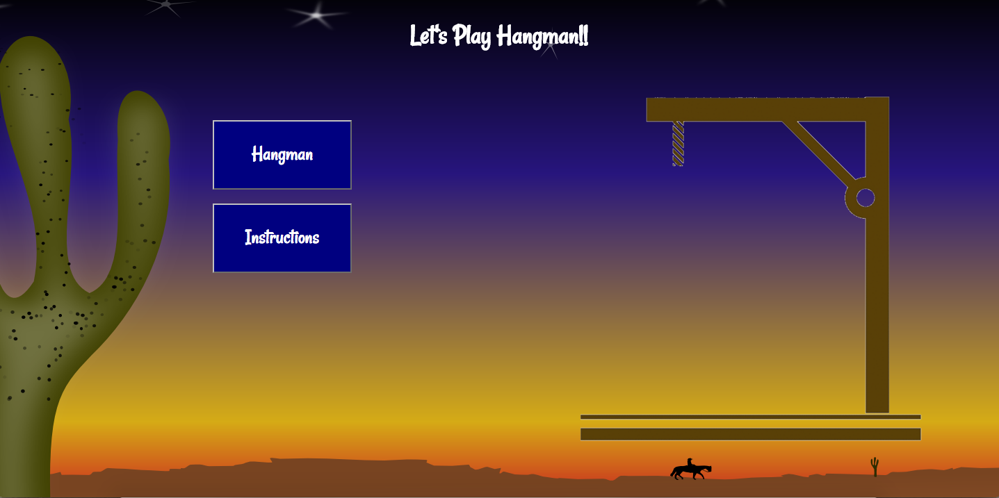
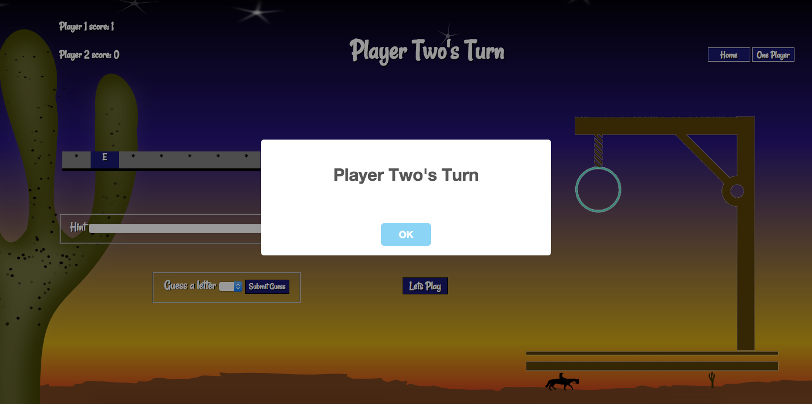

# Hangman
This is a mobile friendly hangman game designed for one and two players. Hints are available in a select menu with a brief description of the medical term's function. It uses jQuery's select menu and flip features, and Sweet Alert's alert functions.

## Screen Shots

## Features
* Hint select menu
* Guess select menu
* Score board
* One and two player options

## Credits
* [Google Fonts - Rancho](https://www.google.com/fonts)
* [jQuery](https://jquery.com/)
* [jQuery UI](https://jqueryui.com/)
* [jQuery Flip](https://nnattawat.github.io/flip/)
* [Pixabay](https://pixabay.com/en/cactus-country-cowboy-desert-stars-152104/)
* [Sweet Alert](http://t4t5.github.io/sweetalert/)
* [Science Kids](http://www.sciencekids.co.nz/sciencefacts/humanbody.html)

## Known Bugs
* When 6 incorrect guesses are made and the hangman image is complete a thin white line appears under the image.
